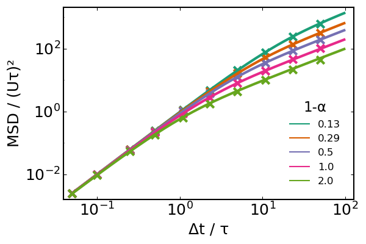

# Validation
It's important to check that our microbes behave as expected.
In this section, we compare various `BacteriaBasedModels.jl` functionalities against
theoretical results from the literature.
If some functionality lacks validation please open an issue.

## Velocity autocorrelation functions
The velocity autocorrelation functions for different swimming patterns have been evaluated analytically by Taktikos et al. (2013)<sup>1</sup>.


First, we will set identical parameters for all the swimmers.
For `RunReverse` and `RunReverseFlick` we will assume that the properties in the forward and backward mode are identical.
```julia
U = 30.0 # swimming speed in μm/s
τ_run = 1.0 # average unbiased run time in s
ω = 1 / τ_run # average unbiased turn rate in 1/s
Δt = 0.01 # integration timestep in s
extent = 1e4 # domain size in μm
```
We initialise three distinct populations, differing only in their motility, merge them all into a single population and initialise our model
```julia
n = 200 # number of microbes in each population
microbes_runtumble = [
    Microbe{3}(id=i,
        turn_rate=ω, motility=RunTumble(speed=[U])
    )
    for i in 1:n
]
microbes_runrev = [
    Microbe{3}(id=n+i,
        turn_rate=ω, motility=RunReverse(speed_forward=[U])
    )
    for i in 1:n
]
microbes_runrevflick = [
    Microbe{3}(id=2n+i,
        turn_rate=ω, motility=RunReverseFlick(speed_forward=[U])
    )
    for i in 1:n
]

microbes = vcat(
    microbes_runtumble, microbes_runrev, microbes_runrevflick
)

model = initialise_model(;
    microbes,
    extent, periodic = true,
    timestep = Δt
)
```

To evaluate the velocity autocorrelation functions, we only need to store the `:vel` field of the microbes during the simulation.
To get a good statistics we need simulation times that are sufficiently longer than the average run length `τ_run`.
```julia
nsteps = round(Int, 100τ_run / Δt)
adata = [:vel]
adf, = run!(model, microbe_step!, nsteps; adata)
```

We can now separate the dataframes for the three subpopulations by their motility type and evaluate their velocity autocorrelation functions using the built-in `autocorrelation` function.
For large amounts of data `autocorrelation` can take some time (O(t<sup>2</sup>n)).
```julia
adf_runtumble = filter(:id => id -> model.agents[id].motility isa RunTumble, adf)
adf_runrev = filter(:id => id -> model.agents[id].motility isa RunReverse, adf)
adf_runrevflick = filter(:id => id -> model.agents[id].motility isa RunReverseFlick, adf)
adfs = [adf_runtumble, adf_runrev, adf_runrevflick]

Φ = hcat([autocorrelation(a,:vel) for a in adfs]...)
```

The theoretical values (normalized) are given by Taktikos et al. (2013)<sup>1</sup>.
```julia
t = range(0, (nsteps-1)*Δt; step=Δt)
Φ_theoretical = hcat([
    exp.(-t ./ τ_run),
    exp.(-t ./ (τ_run / 2)),
    (1 .- t ./ (2τ_run)) .* exp.(-t ./ τ_run),
]...)
```

Agreement between our simulation and theory is great.
```julia
plot(
    xlims=(0,6τ_run), ylims=(-0.1, 1.05),
    xlab="Δt / τ",
    ylab="velocity autocorrelation",
)
plot!(t, Φ_theoretical, lw=2, lc=[1 2 3], label=["Run-Tumble" "Run-Reverse" "Run-Reverse-Flick"])
# slice simulation data for better visibility
scatter!(t[1:15:end], Φ[1:15:end,:] ./ U^2, m=:x, mc=[1 2 3], label=false)
hline!([0.0], lw=0.8, ls=:dash, lc=:black, lab=false)
```


## Mean-squared displacement
It's also easy to evaluate the mean-squared displacement (MSD) of our microbes during a simulation.
We will now run simulations of run-tumble bacteria using different reorientation distributions (parameterized by the average reorientation angle θ), and compare the MSD as a function of θ to theoretical expectations using the well-known diffusivity formula by Berg, D = U²τ/3α, where the persistence factor α=1-cosθ.

We will setup our systems as usual and then run each simulation independently
```julia
θs = [π/6, π/4, π/3, π/2, π]

U = 30.0 # μm/s 
τ_run = 1.0 # s 
ω = 1 / τ_run

nmicrobes = 100
microbes = [
    [
        Microbe{3}(
            id = n, turn_rate = ω,
            motility = RunTumble(speed=Degenerate(U), yaw=Degenerate(θ))
        ) for n in 1:nmicrobes 
    ] for θ in θs
]

dt = 0.05 # s 
L = 500.0 # μm
models = [
    initialise_model(;
        microbes = microbes[i],
        timestep = dt, extent = L
    ) for i in eachindex(microbes)
]

nsteps = round(Int, 100τ_run / dt)
adata = [:pos]
adfs = [run!(model, microbe_step!, nsteps; adata)[1] for model in models]
```

We can now evaluate the MSD for each population using the `msd` function; since the simulations were performed in a periodic domain, we will need to specify the size of the domain as a keyword argument
```julia
MSD = msd.(adfs; L=L)
```
We can now slice our experimental data and plot the results.
```julia
ts = (1:nsteps).*dt

logslice = [1,2,5,10,25,50,100,250,500,1000]
plot(
    xlab = "Δt (s)",
    ylab = "MSD (μm²/s)",
    legend = :bottomright, legendtitle = "1-cosθ",
    scale = :log10
)
scatter!(ts[logslice], hcat(MSD...)[logslice,:],
    m=:x, ms=6, msw=2, lab=false)
for i in eachindex(θs)
    α = 1 - cos(θs[i])
    τ = τ_run / α
    D = U^2*τ / 3
    dr² = @. 2*U^2*τ^2 * (ts/τ - 1 + exp(-ts/τ))
    plot!(ts, dr², lab=round(α,digits=2), lc=i, lw=2)
end # for
plot!()
```




## References
1. Taktikos, J.; Stark, H.; Zaburdaev, V. How the Motility Pattern of Bacteria Affects Their Dispersal and Chemotaxis. PLoS ONE 2013, 8 (12), e81936. https://doi.org/10.1371/journal.pone.0081936.
