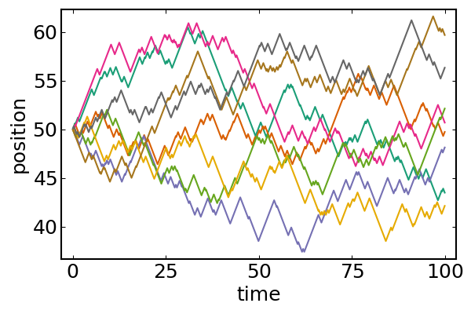
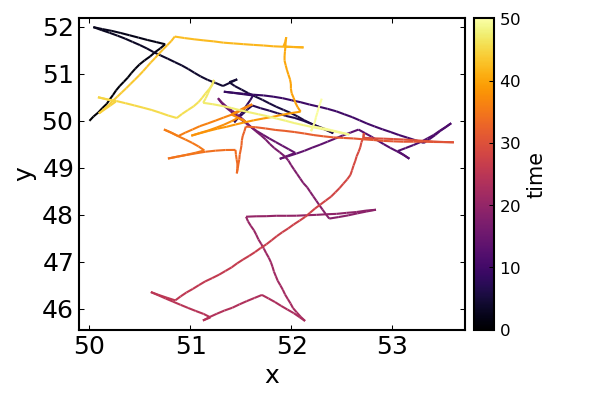

# Tutorial
Ready-to-run scripts for the functionalities introduced here can be found in the `examples` directory of the [repo](https://github.com/mastrof/BacteriaBasedModels).

## Creating a bacterium
Bacteria are represented by custom types, that must be subtypes of the `AbstractAgent` type implemented by Agents.jl.
```@docs
AbstractMicrobe
```
By default, BacteriaBasedModels provides a basic `Microbe` type, that is usually sufficient for the simplest types of simulations.
```@docs
Microbe
```

In order to create a `Microbe` living in a one-dimensional space we can just call
```julia
Microbe{1}(id=0)
```
It is *required* to pass a value to the `id` argument (this behavior might change in the future).
All the other parameters will be given default values (as described in the type docstring) if not assigned explicitly.

Similarly, for bacteria living in two or three dimensions we can use
```julia
Microbe{2}(id=0)
Microbe{3}(id=0)
```

Custom parameters can be set via kwargs:
```julia
Microbe{3}(
    id = 0,
    pos = (300.0, 0.0, 0.0),
    motility = RunTumble(speed = Normal(40.0, 4.0)),
    vel = rand_vel(3) .* 40.0,
    turn_rate = 1.5,
    state = 0.0,
    rotational_diffusivity = 0.035,
    radius = 0.5
)
```

## Creating a model
BacteriaBasedModel provides a fast way to initialise an `AgentBasedModel` (from Agents.jl) via the
`initialise_model` function, using a typical procedure.
If higher levels of customization are needed, the model will need to be created by hand.
```@docs
initialise_model
```

We can now generate a population of microbes and, after choosing an integration timestep and a domain size, we initialise our model, placing the microbes at random locations in the domain.
```julia
microbes = [Microbe{3}(id=i) for i in 1:10]
timestep = 0.1
extent = 100.0
model = initialise_model(;
    microbes = microbes,
    timestep = timestep,
    extent = extent
)
```

```
AgentBasedModel with 10 agents of type Microbe
 space: periodic continuous space with (100.0, 100.0, 100.0) extent and spacing=5.0
 scheduler: fastest
 properties: timestep
```


## Random walks
Now we can already generate random walks.
The setup follows previous sections.
```julia
timestep = 0.1
extent = 1e6 # just a large value to stay away from boundaries
nmicrobes = 8
# initialise all microbes at same position
microbes = [Microbe{1}(id=i, pos=(L/2,)) for i in 1:nmicrobes]

model = initialise_model(;
    microbes,
    timestep,
    extent, periodic = false,
    random_positions = false
)
```

Now we need to define the `adata` variable to choose what observables we want to track, throughout the simulation, for each agent in the system. In our case, only the position field
```julia
adata = [:pos]
```
Now we can run the simulation; the `microbe_step!` function will take care of the stepping and reorientations according to the properties of each microbe:
```julia
nsteps = 1000
adf, = run!(model, microbe_step!, nsteps; adata)
```

```julia
x = first.(vectorize_adf_measurement(adf, :pos))'
plot(
    (0:nsteps).*dt, x,
    legend = false,
    xlab = "time",
    ylab = "position"
)
```


Similarly for a two-dimensional random walk, using run-reverse-flick motility and non-zero rotational diffusion:
```julia
dt = 0.1
L = 1000.0
nmicrobes = 1
microbes = [
    Microbe{2}(
        id=i, pos=(L/2,L/2),
        motility=RunReverseFlick(),
        rotational_diffusivity = 0.2,
        ) for i in 1:nmicrobes
]

model = initialise_model(;
    microbes,
    timestep = dt,
    extent, periodic = false,
    random_positions = false,
)

nsteps = 500
adata = [:pos]
adf, = run!(model, microbe_step!, nsteps; adata)

traj = vectorize_adf_measurement(adf, :pos)
x = first.(traj)'
y = last.(traj)'
plot(
    x, y, line_z = (0:nsteps).*dt,
    legend=false,
    xlab = "x", ylab = "y",
    colorbar = true, colorbar_title = "time"
)
```



Microbes with different motile patterns can also be combined in the same simulation, without extra complications or computational costs:
```julia
n = 3
microbes_runtumble = [Microbe{2}(id=i, motility=RunTumble()) for i in 1:n]
microbes_runrev = [Microbe{2}(id=n+i, motility=RunReverse()) for i in 1:n]
microbes_runrevflick = [Microbe{2}(id=2n+1, motility=RunReverseFlick()) for i in 1:n]
microbes = vcat(
    microbes_runtumble, microbes_runrev, microbes_runrevflick
)
```


## Chemotaxis in a linear gradient
We will now reproduce a classical chemotaxis assay: bacteria in a rectangular channel with a linear attractant gradient.

`BacteriaBasedModels.jl` requires three functions to be defined for the built-in chemotaxis models to work: `concentration_field`, `concentration_gradient`, and `concentration_time_derivative`; all three need to take the two arguments `(pos, model)`.
First we need to define our concentration field and its gradient (we don't define its time derivative since it will be held constant). We will use a linear gradient in the `x` direction.
Here we can define also the gradient analytically, in more complex cases it can be evaluated numerically through the finite difference interface.
```julia
concentration_field(x,y,C₀,∇C) = C₀ + ∇C*x
function concentration_field(pos, model)
    x, y = pos
    C₀ = model.C₀
    ∇C = model.∇C
    concentration_field(x, y, C₀, ∇C)
end
concentration_gradient(x,y,C₀,∇C) = [∇C, 0.0]
function concentration_gradient(pos, model)
    x, y = pos
    C₀ = model.C₀
    ∇C = model.∇C
    concentration_gradient(x, y, C₀, ∇C)
end
```


We choose the parameters, initialise the population (with two distinct chemotaxers) with all bacteria to the left of the channel, and setup the model providing the functions for our concentration field to the `model_properties` dictionary.
```julia
timestep = 0.1 # s
Lx, Ly = 1000.0, 500.0 # μm
extent = (Lx, Ly) # μm
periodic = false

n = 50
microbes_brumley = [
    MicrobeBrumley{2}(id=i, pos=(0,rand()*Ly), chemotactic_precision=1)
    for i in 1:n
]
microbes_brown = [
    MicrobeBrownBerg{2}(id=n+i, pos=(0,rand()*Ly))
    for i in 1:n
]
microbes = [microbes_brumley; microbes_brown]

C₀ = 0.0 # μM
∇C = 0.01 # μM/μm
model_properties = Dict(
    :concentration_field => concentration_field,
    :concentration_gradient => concentration_gradient,
    :concentration_time_derivative => (_,_) -> 0.0,
    
    :compound_diffusivity => 500.0, # μm²/s
    :C₀ => C₀,
    :∇C => ∇C,
)

model = initialise_model(;
    microbes,
    timestep,
    extent, periodic,
    model_properties,
    random_positions = false
)
```
Notice that we also defined an extra property `compound_diffusivity`. This quantity is *required* by the models of chemotaxis that use sensing noise (such as `Brumley`, `XieNoisy`, `CelaniNoisy`). `500 μm²/s` is a typical value for small molecules.

We can run the simulation as usual and extract the trajectories.
```julia
adata = [:pos]
nsteps = 1000 # corresponds to 100s
adf, = run!(model, microbe_step!, nsteps; adata)

traj = vectorize_adf_measurement(adf, :pos)
x = first.(traj)'
y = last.(traj)'
```
Comparing the trajectories for the two bacterial species we witness a chemotactic race (`Brumley` in blue, `BrownBerg` in orange).

